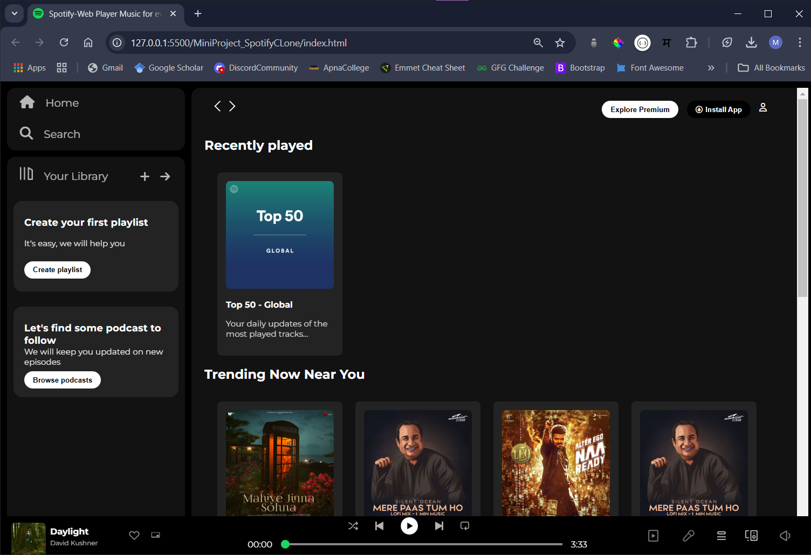
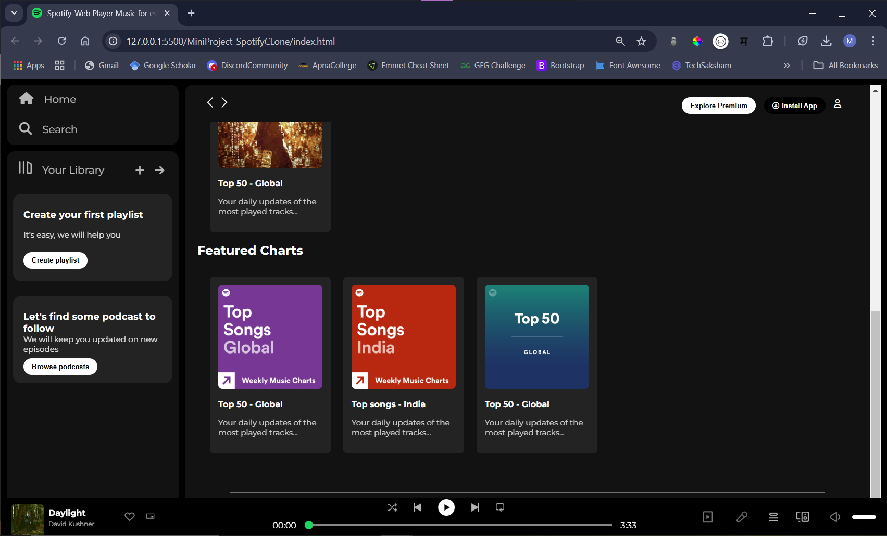

# Spotify-Clone
Spotify Clone is a music streaming app built with a responsive UI, featuring audio playback, playlist management, and user authentication, mimicking the Spotify experience.

## Features

- **Responsive Design**: The layout adapts to different screen sizes and works on both desktop and mobile devices.
- **Sidebar Navigation**: Includes options like "Home", "Search", and "Your Library".
- **Music Player**: Displays album artwork, artist names, and controls for playback (play, pause, skip, etc.).
- **Trending & Recently Played**: Showcases trending music and recently played tracks in card layouts.
- **Playlist & Podcast Suggestions**: Includes calls to action for creating playlists and browsing podcasts.

## Screenshots

## Technologies Used

- **HTML**: Used for creating the structure and content of the page.
- **CSS**: Styled the page to mimic the Spotify web player design, including custom fonts, colors, and responsive layouts.

## Folder Structure

- **assets**: Contains all the images and icons used in the project (e.g., album artwork, icons, and logos).
- **style.css**: The main stylesheet that styles the page layout, navigation, player, and cards.
- **index.html**: The main HTML file that contains the structure of the Spotify clone.
